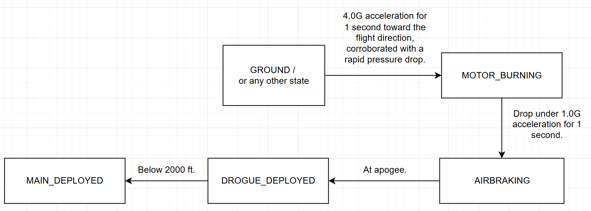

# System Design

## FreeRTOS Tasks

### Sensor Task

### Telemetry Task

### Airbrake Task

## Flight Stages

Flight state will be handled using a simple state machine.

This state will be stored inside the STM32 RTC backup SRAM and powered by a coin cell battery on the flight computer so it persists between resets.

> 
> Proposed state machine for flight state.